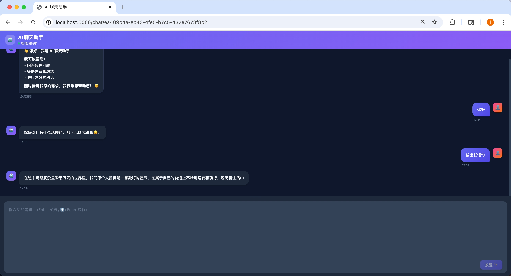

# Agent-Test - AI 聊天助手

一个具备**长期记忆**和**流式响应**的 AI 聊天助手。

## 核心特性

- **🔄 实时流式输出**：基于 SSE (Server-Sent Events)，逐字返回 LLM 响应，提供流畅的对话体验
- **🧠 持久化记忆**：使用 LangGraph Checkpoint + SQLite，每个对话线程独立保存历史上下文
- **📊 智能摘要**：自动压缩长对话历史，保持上下文连贯性的同时控制 Token 消耗
- **⚡ 简洁架构**：纯 Flask + LangGraph，无冗余依赖，易于理解和扩展
- **🛠️ 生产就绪**：提供完整的启动/停止脚本，日志管理，异常处理机制

## 预览



## 快速开始

### 1. 安装依赖

```bash
pip install -r requirements.txt
```

### 2. 配置环境变量

复制配置模板并修改：

```bash
cp .env.example .env
```

然后编辑 `.env` 文件，填入你的配置：

```bash
# 必填
OPENAI_API_KEY=your_actual_api_key_here
OPENAI_BASE_URL=https://api.openai.com/v1
OPENAI_MODEL_NAME=gpt-4

# 可选（已有默认值）
TEMPERATURE=0.7
MAX_TOKENS=12288
```

### 3. 启动服务

#### 后台启动（生产环境）
```bash
./start.sh
```

#### 停止服务
```bash
./stop.sh
```

#### 重启服务
```bash
./restart.sh
```

#### 查看状态
```bash
./status.sh
```

#### 前台启动（开发调试）
```bash
python server.py
```

## 目录结构

```
.
├── server.py           # Flask 服务入口
├── src/
│   ├── main.py        # LangGraph 工作流定义
│   └── agents/
│       ├── chatbox.py # 聊天 Agent
│       └── models.py  # 数据模型和工具函数
├── static/
│   └── index.html     # 前端页面
├── data/              # SQLite checkpoint 存储
├── logs/              # 日志文件
│   └── server.log    # 服务日志（所有输出）
└── *.sh               # 启动脚本

```

## 访问地址

启动成功后访问：http://127.0.0.1:5000

## 日志查看

```bash
# 实时查看日志
tail -f logs/server.log

# 查看最近 50 行
tail -50 logs/server.log

# 搜索错误
grep ERROR logs/server.log
```

## 技术栈

- **工作流引擎**: LangGraph - 状态管理 + 可中断流式执行
- **Web 框架**: Flask + SSE - 服务端事件推送实现实时流式响应
- **LLM 接入**: LangChain + OpenAI API（兼容所有 OpenAI 格式端点）
- **持久化层**: LangGraph Checkpoint + SQLite - 零配置的对话历史存储
- **前端界面**: 原生 HTML/CSS/JavaScript - 无构建依赖，开箱即用

